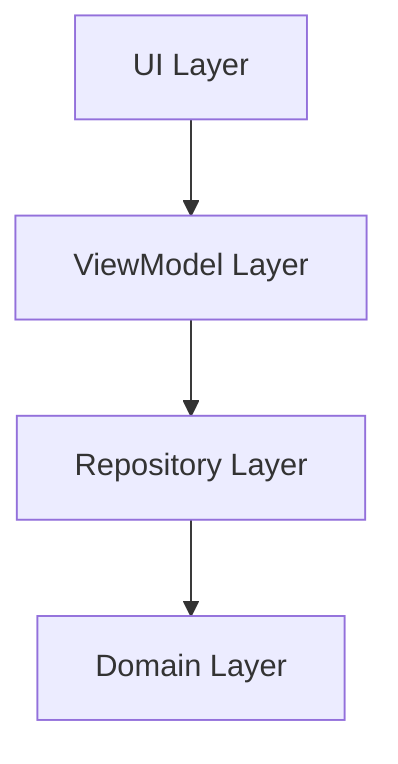

# Documentation Conventions

Project-specific documentation standards for Witchers Medallion. Covers localization files, skill documentation, architecture diagrams, README, and error message standards.

## When to Use

- Adding new UI strings
- Creating or updating skill documentation
- Writing architecture diagrams or technical docs
- Updating README or project documentation
- Adding error messages

## When NOT to Use

- Code comments (project follows minimal commenting -- only when necessary)
- Inline documentation for obvious code

---

# Localization (strings.xml)

### File Locations

| File | Purpose |
|---|---|
| `app/src/main/res/values/strings.xml` | English strings (source of truth) |
| `app/src/main/res/values-ru/strings.xml` | Russian translations |

### Rules

- **Every** new string MUST be added to BOTH files
- English is the source of truth
- Use format placeholders: `%1$s`, `%1$d`, `%2$d`
- Use semantic names for string resources

### Naming Convention

```xml
<!-- Pattern: <screen>_<element>_<property> -->
<string name="connection_status">Connection Status:</string>
<string name="scan_devices">Scan Devices</string>
<string name="error_loading_macs">Error loading MAC addresses: %1$s</string>
<string name="rssi_unit">%1$d dBm</string>
<string name="slider_label_format">%1$s: %2$d dBm</string>
```

### Categories (use XML comments to group)

```xml
<resources>
    <!-- Main Activity -->
    <string name="main_tab">Main</string>

    <!-- Main -->
    <string name="connection_status">Connection Status:</string>

    <!-- Calibration -->
    <string name="manual_calibration">Manual Calibration</string>

    <!-- MAC Tracking -->
    <string name="mac_address">MAC Address</string>

    <!-- Devices search -->
    <string name="device_name">Name</string>

    <!-- Dialogs -->
    <string name="confirm_connection">Confirm Connection</string>

    <!-- Error messages -->
    <string name="error_loading_macs">Error loading MAC addresses: %1$s</string>

    <!-- BLE Scan Errors -->
    <string name="scan_error_bluetooth_disabled">Bluetooth is disabled</string>
</resources>
```

### DO

- Add strings to BOTH `values/strings.xml` and `values-ru/strings.xml`
- Use semantic resource names
- Group related strings with XML comments
- Use format placeholders for dynamic values
- Keep string values concise and clear

### DON'T

- Add strings to only one localization file
- Use hardcoded strings in Compose or Kotlin code
- Put long descriptions in string resources (use `UiText.DynamicString` for dynamic content)
- Use the same resource name for different strings

### Usage in Code

```kotlin
// Compose
Text(stringResource(R.string.scan_devices))
Text(text = stringResource(R.string.connected_device, deviceName))

// ViewModel error
errorMessage = UiText.fromStringResource(R.string.error_loading_macs, e.message ?: "")

// Resolving UiText in Compose
Text(uiState.errorMessage!!.getString(LocalContext.current))
```

---

# Skill Documentation

### File Location

`.kilo/skills/<skill-name>/SKILL.md`

### Required Frontmatter

```yaml
---
name: skill-name
description: Brief description of what the skill covers. Use when ...
origin: AI-generated
---
```

### Structure

```markdown
# Skill Title

Brief description of what this skill covers.

## When to Use

- When doing X
- When doing Y

## When NOT to Use

- When doing Z (use skill-A instead)

---

# Section Title

## Subsection

### DO

```kotlin
// good example
```

### DON'T

```kotlin
// bad example
```

---

# Detection Heuristics

- Check for X
- Check for Y

---

# Related Skills

- skill-a
- skill-b
```

### DO

- Include `When to Use` and `When NOT to Use` sections
- Include `DO` / `DON'T` examples with code snippets
- Include `Detection Heuristics` section
- Include `Related Skills` section
- Keep frontmatter `description` under 200 characters
- Use `origin: AI-generated` for AI-generated skills, `origin: ECC` for engineer-crafted skills

---

# Architecture Diagrams

### File Location

`doc/diagrams.md`

### Format

Mermaid diagrams with descriptions.



### DO

- Use Mermaid syntax for diagrams
- Include a description section after each diagram
- Number diagrams sequentially
- Cover: architecture, use cases, sequence diagrams
- Keep diagram labels concise

### Diagram Types Used

| Type | Use Case |
|---|---|
| `graph TB` | Component architecture |
| `graph LR` | Use cases, flows |
| `sequenceDiagram` | Interaction flows |

---

# README

### File Location

Project root: `README.md`

### Required Sections

1. Project title and brief description
2. What It Does (screen descriptions)
3. Architecture (layer diagram)
4. Tech Stack (table)
5. Building (commands)
6. Project Structure (directory tree)
7. Static Analysis Configuration
8. Testing
9. License
10. Known Bugs / TODOs

### DO

- Keep README concise
- Use tables for tech stack and commands
- Mirror project structure in directory tree
- List known issues in a dedicated section
- Update when architecture or commands change

---

# Code Comments

### Project Policy: Minimal Comments

The project follows a **no unnecessary comments** policy.

### DO

- Add comments only for non-obvious logic
- Document complex byte-parsing algorithms
- Document magic numbers that aren't named constants
- Document invariants and preconditions

```kotlin
// Document why: not what
// Version 1 protocol requires little-endian encoding
val version = readUint16LE(bytes, 0)
```

### DON'T

- Comment obvious code
- Add Javadoc-style documentation blocks
- Write inline comments for self-explanatory functions
- Use TODO comments (use Known Bugs section in README instead)

---

# Error Messages

### In UI (strings.xml)

```xml
<!-- Error messages -->
<string name="error_loading_macs">Error loading MAC addresses: %1$s</string>
<string name="error_invalid_mac_format">Invalid MAC address format</string>
<string name="error_general">An error occurred: %1$s</string>

<!-- BLE Scan Errors -->
<string name="scan_error_bluetooth_disabled">Bluetooth is disabled</string>
<string name="scan_error_scanner_unavailable">Scanner unavailable</string>
<string name="scan_error_connection_failed">Connection failed</string>
<string name="scan_error_gatt_error">GATT error</string>
<string name="scan_error_timeout">Operation timed out</string>
```

### In ViewModel (UiText)

```kotlin
_uiState.update {
    it.copy(errorMessage = UiText.fromStringResource(R.string.error_loading_macs, e.message ?: ""))
}
```

### DO

- Use `UiText.fromStringResource()` for localized errors
- Include context in error messages (`%1$s` for details)
- Use sealed hierarchy for BLE errors (`BleScanError`)
- Keep error messages user-friendly

### DON'T

- Hardcode error strings in ViewModels
- Pass raw `Throwable` to UI
- Use generic "Error" without context
- Leak technical details to users

---

# AGENTS.md

### File Location

Project root: `AGENTS.md`

### Purpose

Master reference for AI coding agents. Contains:
- Tech stack
- Architecture rules
- Naming conventions
- Anti-patterns
- Useful commands
- Important files

### DO

- Keep AGENTS.md as the single source of truth for conventions
- Update when new patterns or rules are established
- Include detection heuristics and anti-patterns
- List useful Gradle commands
- Reference skill files for detailed guidance

---

# Detection Heuristics

- Check for strings added to only one localization file
- Check for hardcoded strings in Compose or Kotlin
- Check for missing `origin` field in skill frontmatter
- Check for diagrams without descriptions
- Check for outdated README commands
- Check for error messages not using `UiText`

---

# Related Skills

- `android-kotlin` -- UiText usage, error handling
- `android-composable` -- stringResource() usage in Compose
- `architecture` -- diagram conventions, layer documentation
