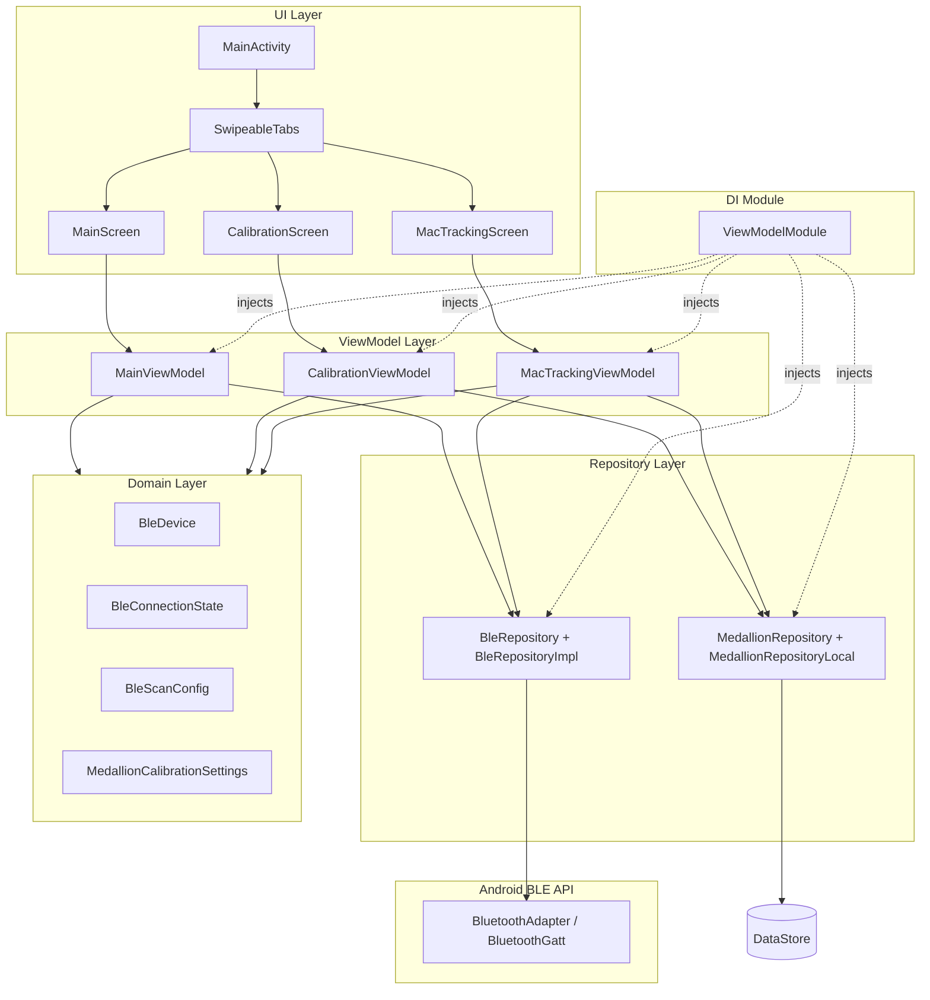
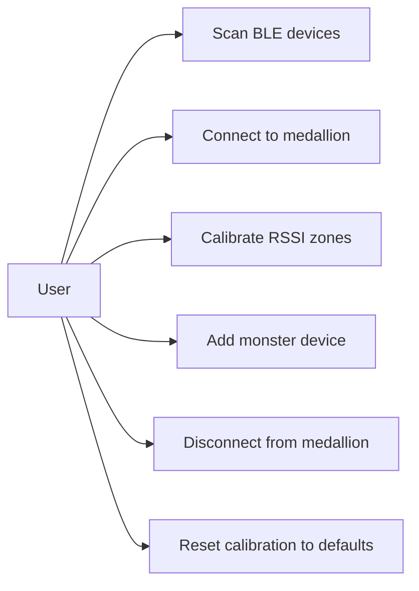
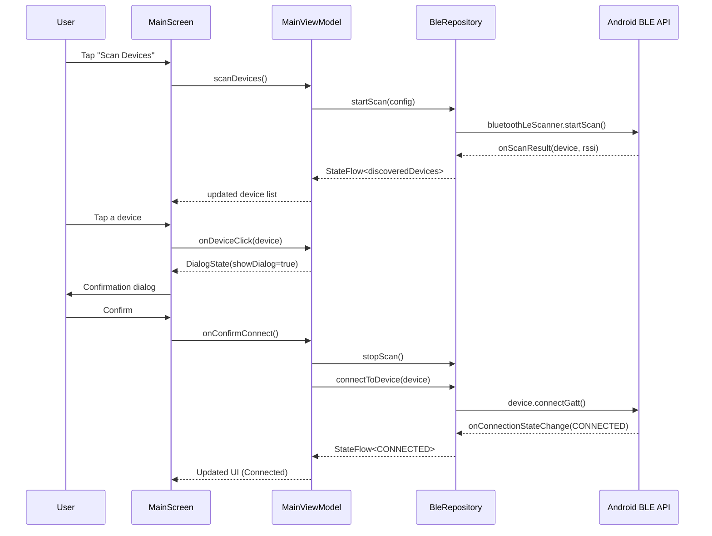
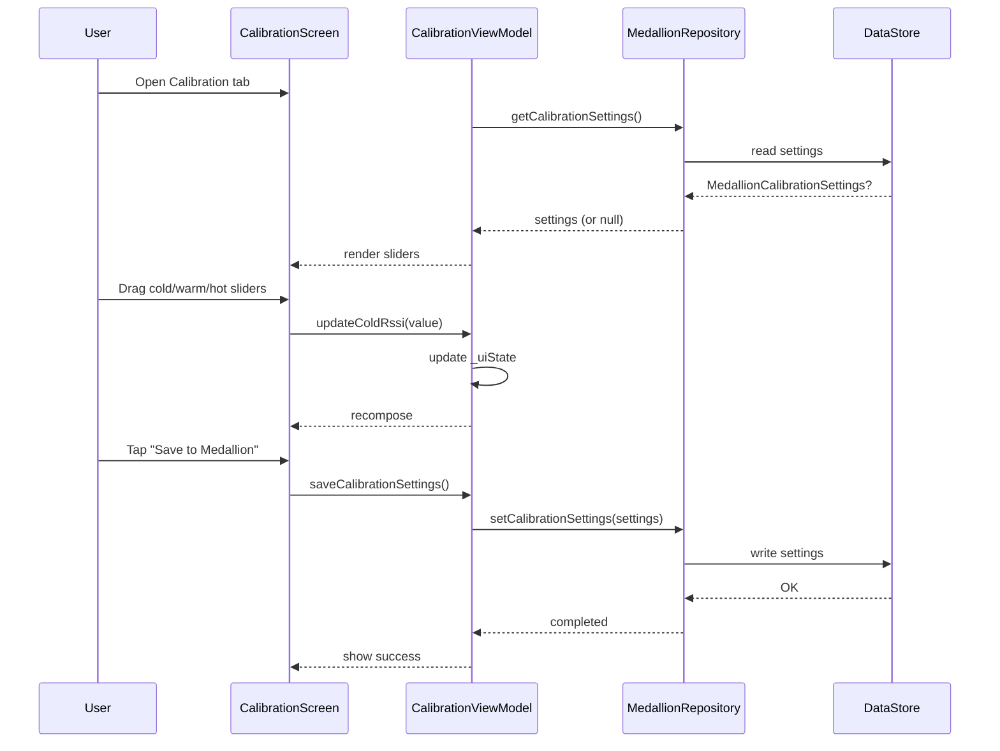
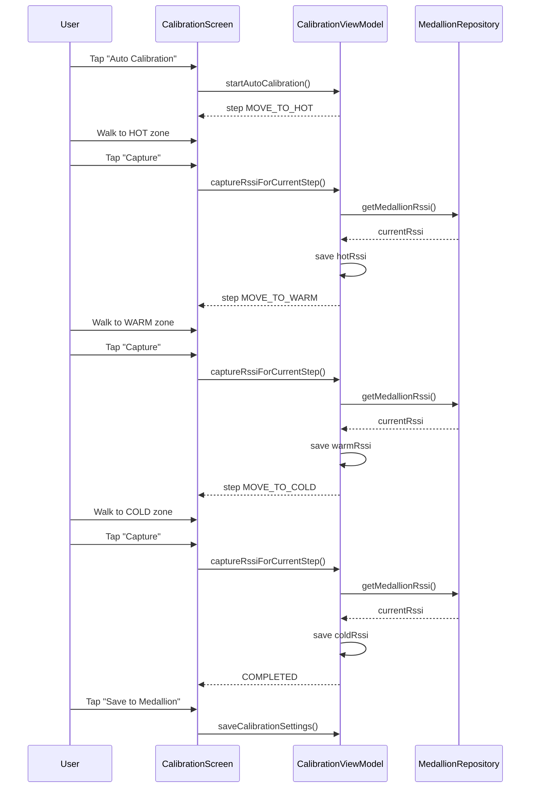

# Witcher's Medallion — Architecture Diagrams

This document contains the Mermaid diagrams and their descriptions from the project planning document.

---

## 1. Architecture Diagram (Components)

Shows the high-level architecture of the app and how its modules depend on each other.

### Description

The app follows MVVM with Clean Architecture, organized into six layers:

- **UI Layer** — `MainActivity` hosts `SwipeableTabs` that manage three screens: `MainScreen` (device scanner + connection status), `CalibrationScreen` (RSSI zone calibration), and `MacTrackingScreen` (monster device tracking).
- **ViewModel Layer** — Each screen has a dedicated ViewModel (`MainViewModel`, `CalibrationViewModel`, `MacTrackingViewModel`) that holds UI state as `StateFlow` and exposes actions.
- **Repository Layer** — `BleRepository` handles BLE scanning and GATT connections. `MedallionRepository` manages local persistence of calibration settings and registered MAC addresses via DataStore.
- **Domain Layer** — Plain Kotlin data classes (`BleDevice`, `BleConnectionState`, `BleScanConfig`, `MedallionCalibrationSettings`) with no Android dependencies.
- **Android BLE API** — The underlying `BluetoothAdapter` and `BluetoothGatt` interfaces.
- **DI Module** — Hilt's `ViewModelModule` injects all ViewModels and repositories.

---

## 2. Use Case Diagram

Lists the core user interactions with the app.

### Description

| # | Use Case | Description |
|---|----------|-------------|
| 1 | Scan BLE devices | Discover nearby BLE devices, including the ESP32 medallion and "monster" devices. |
| 2 | Connect to medallion | Pair the phone with the wearable ESP32 medallion via GATT. |
| 3 | Calibrate RSSI zones | Set cold/warm/hot RSSI thresholds to define proximity zones for the medallion. |
| 4 | Add monster device | Register a new BLE device (MAC address) to be tracked as a "monster." |
| 5 | Disconnect from medallion | Terminate the GATT connection with the medallion. |
| 6 | Reset calibration to defaults | Restore factory RSSI threshold values. |

---

## 3. Sequence Diagram: Connect to Medallion

Shows the step-by-step flow when the user scans for and connects to the medallion.

### Description

1. User taps **Scan Devices** in `MainScreen`, triggering `MainViewModel.scanDevices()`.
2. The view model calls `BleRepository.startScan()`, which invokes the Android `BluetoothLeScanner`.
3. Scan results (device info + RSSI) are returned via callbacks and emitted through a `StateFlow`.
4. The updated device list appears in the UI.
5. User selects a device, which prompts a confirmation dialog (`DialogState`).
6. After confirmation, scanning stops and `connectToDevice()` is called.
7. Android `connectGatt()` initiates the GATT connection.
8. Upon `onConnectionStateChange(CONNECTED)`, the UI updates to show the connected state.

---

## 4. Sequence Diagram: Manual Calibration

Describes the flow of setting RSSI calibration thresholds manually.

### Description

1. User opens the **Calibration** tab. `CalibrationViewModel` loads existing settings from `MedallionRepository`, which reads from DataStore.
2. If settings exist, sliders are populated with current values; otherwise defaults are shown.
3. User drags the cold/warm/hot sliders. Each change updates `_uiState`, triggering a Compose recomposition.
4. User taps **Save to Medallion**. The view model calls `MedallionRepository.setCalibrationSettings()`, which writes the new thresholds to DataStore.
5. Success feedback is displayed.

---

## 5. Sequence Diagram: Auto-Calibration

Describes the guided auto-calibration wizard that walks the user through three proximity zones.

### Description

1. User taps **Auto Calibration** in `CalibrationScreen`. The wizard starts at step `MOVE_TO_HOT`.
2. User walks to the **hot zone** (closest to the medallion) and taps **Capture**. `CalibrationViewModel` reads the current RSSI via `MedallionRepository.getMedallionRssi()` and saves it as `hotRssi`.
3. The wizard advances to `MOVE_TO_WARM`. User walks to the **warm zone** and captures again, saving `warmRssi`.
4. The wizard advances to `MOVE_TO_COLD`. User walks to the **cold zone** (farthest) and captures, saving `coldRssi`.
5. Wizard completes (`COMPLETED`).
6. User taps **Save to Medallion** to persist the three captured thresholds via `MedallionRepository`.
